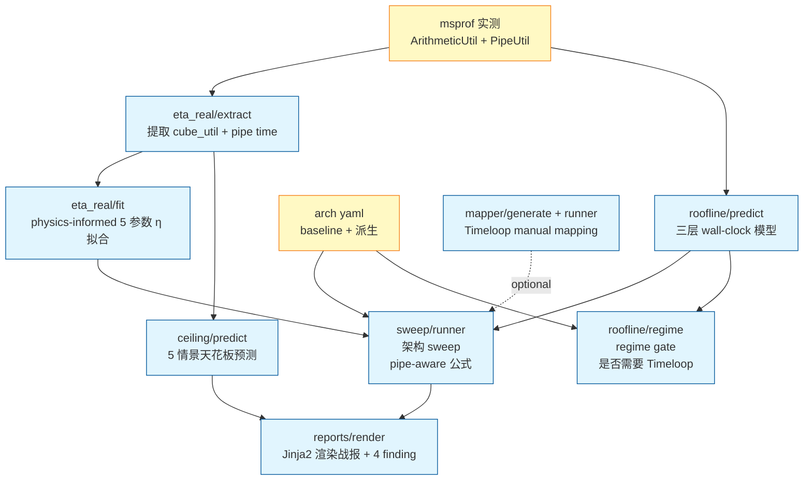

# 总览：NPU仿真实验工具链

## 1. 工具的目的

本工具链回答一个工程决策问题：

> **针对固定网络业务（路由器 / 交换机 / 安全网关 / 流量分类）和未来 LLM 长上下文场景，自研 AI 芯片相对昇腾通用芯片应当如何取舍 die area / 内存 / Cube 算力 / Vector 算力？哪些维度有真实杠杆，哪些是无效投资？**

工具链不直接给出"应当用什么芯片"的答案——它生成**带物理依据的 wall-clock 与 TCO 预测**，让芯片架构师 + 业务方在量化数据上讨论权衡。

## 2. 设计原则

| 原则 | 实施方式 |
|------|---------|
| **实测优先**（不靠纯解析）| 所有 baseline 系数来自昇腾 910B4 实卡 msprof 实测（含 ArithmeticUtilization + PipeUtilization）|
| **公式可解读**（不当黑盒）| Wall-clock 拆为 4 组分（T_aic + T_aiv + kernel_gap + host_gap），每组分进一步按 pipe 拆 |
| **架构敏感度分模块**（不混杠杆）| sweep 11 维度独立改变，每维度对每 workload 的 ratio 单列输出 |
| **优化潜力可量化**（区分软件 vs 硬件）| 5 情景 ceiling 预测：S0 baseline / S1 算子优化 / S2 + runtime / S3 + UB融合 / S4 + HBM3 |
| **历史可追溯**（不删除 phase 数据）| 全部研究过程归档于 `legacy/`，主结构只保留 release-quality 文档 |

## 3. 模块依赖图



**关键依赖**：

- `roofline/predict` 是基础——所有 wall-clock 预测都建在 `T_aic + T_aiv + host_gap` 三层模型上
- `eta_real/fit` 输出的 5 参数（α, β, γ, δ, γ_B）被 `sweep/runner` 用于把 GEMM ops 转 cycles
- `ceiling/predict` 直接读 PipeUtil 实测，不依赖 sweep——是 sweep 的**姊妹工具**而非下游
- `mapper/*` 是可选的 Timeloop 接口——主预测路径不依赖（详见 [04_arch_sensitivity.md](04_arch_sensitivity.md) §为什么不强依赖 Timeloop）

## 4. 文档导航

本目录下 7 篇方法论：

| 文档 | 解决什么问题 | 读者 |
|------|------------|------|
| **本文** | 工具能干什么 + 模块如何串联 | 所有人入门 |
| [02_three_layer_roofline.md](02_three_layer_roofline.md) | wall-clock 怎么从 host overhead + device compute + memory 三层组成？校准如何做？ | 性能工程师、芯片架构师 |
| [03_eta_real_model.md](03_eta_real_model.md) | Cube 实际利用率 η_real(M, N, K, B) 是怎么从 GEMM 几何形状预测的？为什么 Timeloop 的 100% 不可信？ | 算子优化、芯片架构师 |
| [04_arch_sensitivity.md](04_arch_sensitivity.md) | 11 维架构 sweep 怎么设计？pipe-aware 公式如何解锁 mte2/fixpipe 等之前被 max() 吞掉的杠杆？ | 芯片架构师 |
| [05_calibration.md](05_calibration.md) | msprof 数据采集流程；Pipe 字段词典；ATC + ais_bench + analyze 失败模式 | 上机做实验的工程师 |
| [06_assumptions_limits.md](06_assumptions_limits.md) | 全部建模假设和已知局限统一收口；论文审稿人 / 评审专家追问时查这里 | 评审、审稿、复用人 |
| [07_optimization_ceiling.md](07_optimization_ceiling.md) | 给定一个 workload，纯算子优化能降多少 wall-clock？硬件改动可叠加的额外增益是多少？ | 立项决策、CANN 团队 |

衍生文档：

- [tutorials/](../tutorials/) — 4 篇 step-by-step 教程（quickstart / 复现 sweep / 重校准 / 加新模型）
- [reference/](../reference/) — 4 篇参考（YAML schema / Python API / CLI 参数）
- [findings/](../findings/) — 4 份 finding 报告（产品线总裁阅读对象 + 3 份技术性子报告）+ 1 份 ceiling 分析
- [../../legacy/](../../legacy/) — 全部 phase 叙述文档归档（不修改，仅追溯用）

## 5. 工具入口（CLI）

`pip install -e ".[dev]"` 后可直接调用：

| CLI | 模块 | 用途 |
|-----|------|------|
| `prism-extract` | `eta_real.extract` | 从 msprof CSV 提取 per-op pipe time + cube util |
| `prism-fit` | `eta_real.fit` | physics-informed η_real 拟合（输入 9+ shapes，输出 5 参数）|
| `prism-regime` | `roofline.regime` | regime gate：判定 (model, arch) 是 host-bound / compute-bound / memory-bound |
| `prism-sweep` | `sweep.runner` | 11 维架构 sweep（46 变体；Issue #8 起从 12 维移除 host_gap 死维度）|
| `prism-ceiling` | `ceiling.predict` | 5 情景优化天花板预测 |
| `prism-mapping` | `mapper.runner` | Timeloop manual mapping 跑通（Docker 后端）|
| `prism-render` | `reports.render` | Jinja2 渲染 4 份模板化报告到 `docs/findings/` |

**无需 install** 也可直接跑：`python3 scripts/sim_*.py <args>`（薄包装，PYTHONPATH 自动注入）。

完整参数详见 [reference/cli.md](../reference/cli.md)。

## 6. 输入与输出

### 输入

```
arch/                 ← 架构 YAML（baseline 910B4 + for_mapping + for_sweep_v2 派生）
models/               ← 模型 YAML（BERT / GPT-2 / Qwen3 / Net-Transformer / ...）
data/inputs/          ← msprof CSV、ATC OM 实测产物
data/calibration/     ← 拟合后的常数（eta_physics_fit.json、pipe_baseline_per_model.json）
benchmark/            ← NPU 上做实验用的脚本（export ONNX、ATC 转 OM、msprof采集）
```

### 输出

```
data/outputs/         ← sweep 结果、ceiling 结果、regime 矩阵
docs/findings/        ← 4 份模板渲染的 finding 报告 + 1 份 ceiling 分析
```

## 7. 命名约定

| 约定 | 例 |
|------|---|
| **arch 派生 yaml**：`<chip>_<purpose>.yaml` | `ascend_910b4_for_mapping.yaml`、`ascend_910b4_for_sweep_v2.yaml` |
| **拟合输出**：`<model>_fit.json` | `eta_physics_fit.json` |
| **实测数据**：`<metric>_<model>_<config>.csv` | msprof PROF_*/op_summary_*.csv |
| **finding 报告**：`<topic>报告.md` | `主报告.md`、`roofline校准报告.md` |
| **methodology**：`0X_<topic>.md` | `02_three_layer_roofline.md` |

## 8. 已知局限速览

工具链有 8 个 first-class 假设/局限——任何使用本工具的结论必须连同[06_assumptions_limits.md](06_assumptions_limits.md) 一起阅读。最关键的 3 个：

1. **β_layer 假设跨 arch_variant 不变**：减核 / 减 L2 时 host 调度路径会变，β 可能 ±20% 漂移。所有 sweep ratio 是上界估计。
2. **Timeloop classic 不建模非-MAC 算子**：LayerNorm/Softmax/GeLU 没有 dataflow primitive。Vector 端时间通过 analytical pipe 模型预测，不通过 Timeloop。
3. **Cube/AIV 序列化假设**：单层关键路径上 Cube → UB → AIV → UB → Cube 物理 serial。`T_compute = T_aic + T_aiv` 简单加法成立。

## 9. 复现性保证

`pip install -e ".[dev]"` 后：

```bash
prism-render --check    # 4 份模板渲染与已 commit 一致 → exit 0
prism-sweep             # 11 维 sweep 结果与 reference 一致
prism-ceiling           # 5 情景结果与 reference 一致
pytest tests/         # 全绿
```

任意 PR 提交前必须四项全过。详见 [../../CONTRIBUTING.md](../../CONTRIBUTING.md)。

---

## 附：阅读建议

- **第一次读**：本文 → 02 → 04 → 07（建立工具骨架认识）
- **要复现实验**：[tutorials/01_quickstart.md](../tutorials/01_quickstart.md)
- **要加新模型**：[tutorials/04_add_new_model.md](../tutorials/04_add_new_model.md) → [03](03_eta_real_model.md) §如何加 model
- **要加新硬件假想**：[04](04_arch_sensitivity.md) §加新 sweep 维度 + [reference/arch_yaml_schema.md](../reference/arch_yaml_schema.md)
- **审稿 / 内部专家评审**：[06](06_assumptions_limits.md) 全文 + 关心模块的方法论
